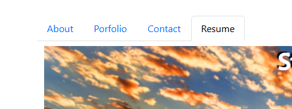

# React Web Portfolio

## Table of Contents
- [Description](#description)
- [Implementation](#implementation)
- [Usage](#usage)
- [Author](#author)
- [Credits](#credits)
- [Images](#images)
- [LINKS](#links)

## Description
Using react + vite we built a porfolio with tabs that navigate through different pages. The site is deployed with Netlify and features "About" as the landing page, as well as the "Porfolio","Contact", and "Resume" pages. The "Contact" tab features a contact form that will allow the viewer to contact us.

## Implementation
Pages were built using React components, such as the Project component, in order to display all projects on the Portfolio tab
```
import Col from 'react-bootstrap/Col';
import Card from 'react-bootstrap/Card';
import Nav from 'react-bootstrap/Nav'

const ProjectList = ({ title, image, liveURL, github }) => {
  return (
    
        <Col>
          <div className="d flex justify-content-around">
            <Card style={{ width: '18rem '}}>
              <Card.Img variant="top" src={image} alt={`${title} Screenshot`} />
              <Card.Body>
                <Card.Title>{title}</Card.Title>         
                  <Nav className="project-links">
                    <Nav.Item>                      
                    <Nav.Link href={liveURL} target="_blank" rel="noopener noreferrer">&#8594; Live URL</Nav.Link>
                    </Nav.Item>                                       
                    <Nav.Item>
                    <Nav.Link href={github} target="_blank" rel="noopener noreferrer">&#8594; GitHub Repo</Nav.Link>
                    </Nav.Item>
                  </Nav>
              </Card.Body>
            </Card>
          </div>
        </Col>        
      
  );
}

export default ProjectList
```
## Usage
Click the live link and view the app by navigating via the nav-tabs:



## Author
Stacy Herbert

## Credits
Anthony Harper

## Images


## LINKS

GitHub Repository: https://github.com/JLH-Owner/react-portfolio

Deployed on Netlify: https://smh-react-portfolio.netlify.app/

# React + Vite

This template provides a minimal setup to get React working in Vite with HMR and some ESLint rules.

Currently, two official plugins are available:

- [@vitejs/plugin-react](https://github.com/vitejs/vite-plugin-react/blob/main/packages/plugin-react/README.md) uses [Babel](https://babeljs.io/) for Fast Refresh
- [@vitejs/plugin-react-swc](https://github.com/vitejs/vite-plugin-react-swc) uses [SWC](https://swc.rs/) for Fast Refresh